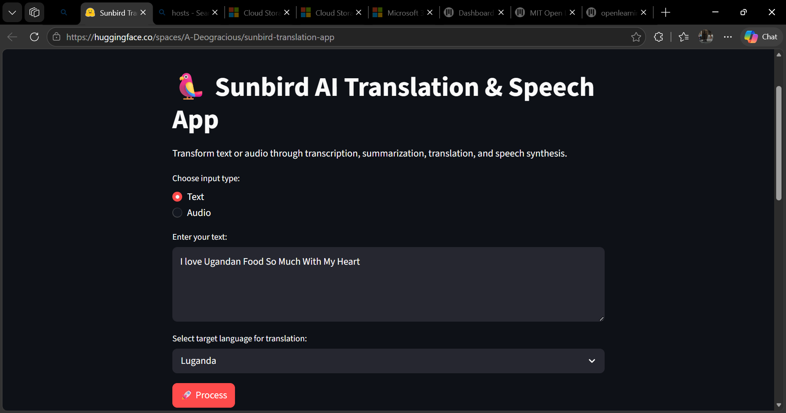
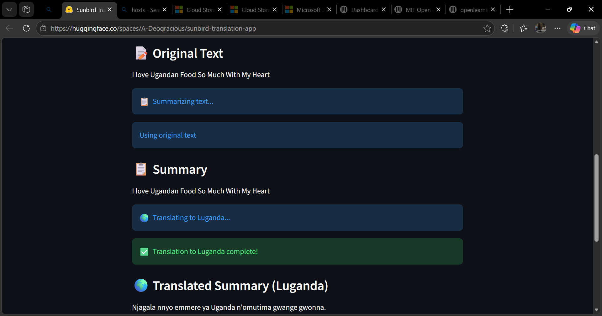
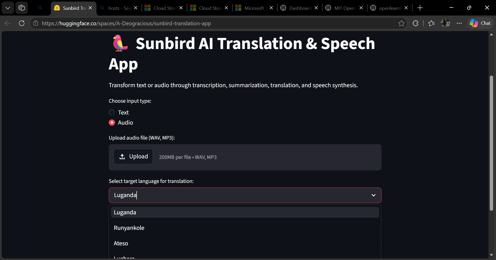

# Sunbird AI Translation App

A web app that processes text or audio through an AI pipeline: transcription → summarization → translation to Ugandan languages → speech synthesis. Built for the Sunbird AI internship assessment.

🔗 **Live Demo**: https://huggingface.co/spaces/A-Deogracious/sunbird-translation-app

## Architecture Overview

The app follows this pipeline:
INPUT (Text or Audio)
↓
Speech-to-Text (if audio) → Sunbird /tasks/stt

↓
Summarization → Sunbird /tasks/summarise

↓
Translation → Sunbird /tasks/sunflower_simple

↓
Text-to-Speech → Sunbird /tasks/tts

↓
OUTPUT (Translated text + audio player)


**API Endpoints Used:**

| Step | Sunbird Endpoint | Purpose |
|------|------------------|---------|
| 1 | `/tasks/stt` | Transcribe audio to text |
| 2 | `/tasks/summarise` | Generate summary of text |
| 3 | `/tasks/sunflower_simple` | Translate English → Ugandan language |
| 4 | `/tasks/tts` | Convert translated text to speech |

## Local Setup

Follow these exact steps to run the app on your machine:

### Prerequisites
- Python 3.8 or higher
- Git
- Sunbird AI API token (sign up free at https://api.sunbird.ai/)

### Installation

**1. Clone the repository**
```bash
git clone https://github.com/A-Deogracious/internship-assessment.git
cd internship-assessment
```

**2. Create and activate virtual environment**

Windows:
```powershell
python -m venv venv
venv\Scripts\activate
```

Mac/Linux:
```bash
python -m venv venv
source venv/bin/activate
```

**3. Install dependencies**
```bash
pip install -r requirements.txt
```

**4. Configure environment variables**

Create a `.env` file in the project root:
```bash
# Windows
New-Item .env

# Mac/Linux
touch .env
```

Add your API token to `.env`:
SUNBIRD_API_TOKEN=your_actual_token_here

text

See `.env.example` for the template.

**5. Run the application**
```bash
streamlit run app.py
```

The app will open automatically in your browser at http://localhost:8501

## Environment Variables

| Variable | Required | Description |
|----------|----------|-------------|
| `SUNBIRD_API_TOKEN` | Yes | Your Sunbird AI API authentication token. Get it from https://api.sunbird.ai/ after creating a free account. Used to authenticate all API requests. |

**Important**: Never commit your `.env` file to version control. It's already in `.gitignore`.

## Usage

### Text Input Example

1. **Select input type**: Choose "Text"
2. **Enter text**: Type or paste your content
Example: "I Love Ugandan Food So Much."

3. **Choose language**: Select target language (e.g., Luganda)
4. **Click Process**: Hit the 🚀 Process button

**Results you'll see:**
- **Original Text**: Your input displayed
- **Summary**: AI-generated shorter version
- **Translation**: Summary translated to Luganda
- **Audio Player**: Hear the Luganda translation spoken

### Audio Input Example

1. **Select input type**: Choose "Audio"
2. **Upload file**: Select a WAV or MP3 file (max 5 minutes)
3. **Choose language**: Pick translation language
4. **Click Process**: Start the pipeline

**Results:**
- **Transcribed Text**: What was said in the audio
- **Summary**: Shortened version
- **Translation**: In your chosen language
- **Audio Player**: Speech output

### Screenshots

**Main Interface (Text Input):**



**Processing Results:**



**Audio Upload Interface:**



## Project Structure
internship-assessment/
├── app.py # Main Streamlit application
├── exercises/
│ └── basics.py # Part 1: Programming exercises
├── tests/
│ └── test_basics.py # Unit tests for Part 1
├── constants.py # Test constants
├── requirements.txt # Python dependencies
├── .env # Environment variables (not in repo)
├── .env.example # Environment variables template
├── .gitignore # Git ignore rules
└── README.md # This file


## Known Limitations

1. **Audio file size**: Maximum 10MB per file (~5 minutes of audio). Larger files are rejected to prevent timeout errors.

2. **Text-to-Speech reliability**: The TTS endpoint sometimes times out during high server load. This is a Sunbird API server issue, not a code bug. The app handles this gracefully with error messages.

3. **Supported languages**: Translation only works for 5 Ugandan languages:
   - Luganda (lug)
   - Runyankole (nyn)
   - Ateso (teo)
   - Lugbara (lgg)
   - Acholi (ach)

4. **Audio formats**: Only WAV and MP3 files are supported for upload.

5. **API rate limits**: Subject to Sunbird AI's free tier rate limits.

6. **Summarization quality**: Summary quality depends on Sunbird's AI model - sometimes it may return the original text if summarization is unavailable.

## Troubleshooting

**Error: "Translation failed: 401"**  
→ Your API token is missing or invalid. Check that `SUNBIRD_API_TOKEN` is correctly set in your `.env` file.

**Error: "TTS timed out"**  
→ Sunbird's TTS server is slow or overloaded. Try again with shorter text or wait a few minutes.

**Error: "Audio file too large"**  
→ Your audio file exceeds 10MB. Compress it or trim to under 5 minutes.

**App won't start**  
→ Make sure all dependencies are installed: `pip install -r requirements.txt`

## Tech Stack

- **Frontend/Backend**: Streamlit (Python web framework)
- **AI Services**: Sunbird AI (all AI capabilities)
- **Key Libraries**: 
  - `streamlit` - Web interface
  - `requests` - HTTP API calls
  - `python-dotenv` - Environment configuration
  - `base64` - Audio encoding/decoding

## Development

**Run tests:**
```bash
pytest
```

All tests in `tests/test_basics.py` should pass.

## Credits

**Builder**: Arinda Deogracious  
**Purpose**: Sunbird AI Internship Assessment (May 2026)  
**AI Provider**: [Sunbird AI](https://sunbird.ai/)  

---

**Powered by Sunbird AI 🦜**